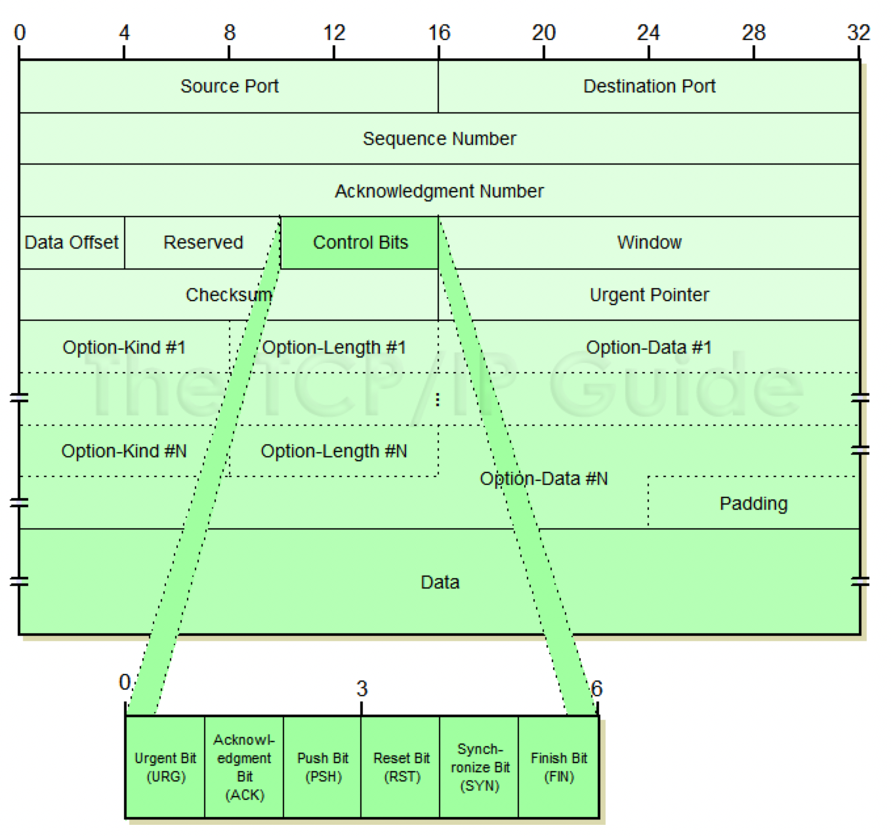
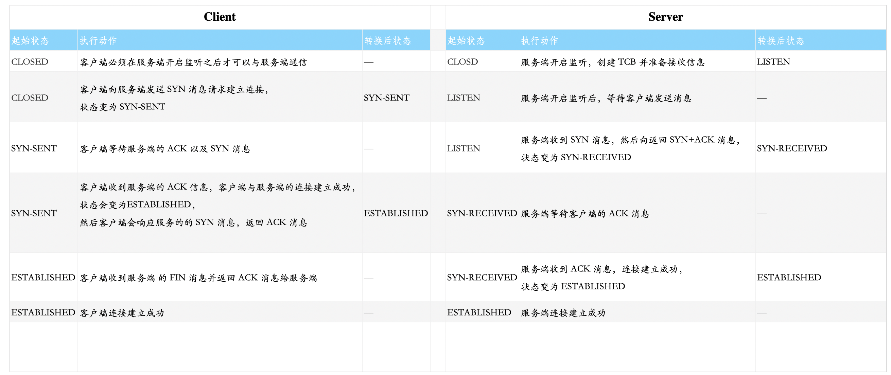
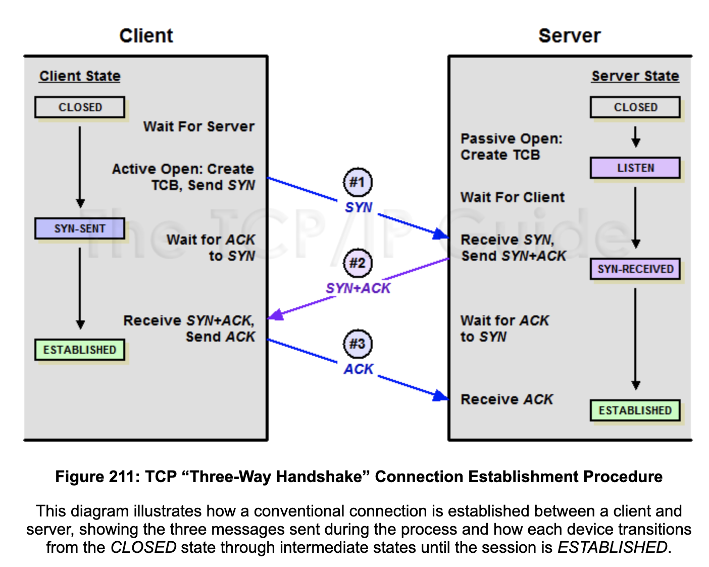
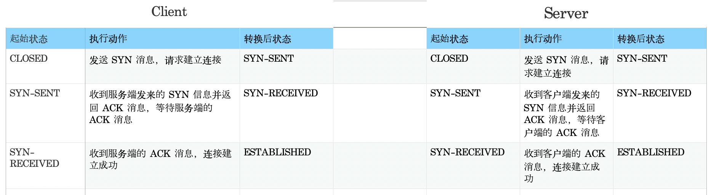
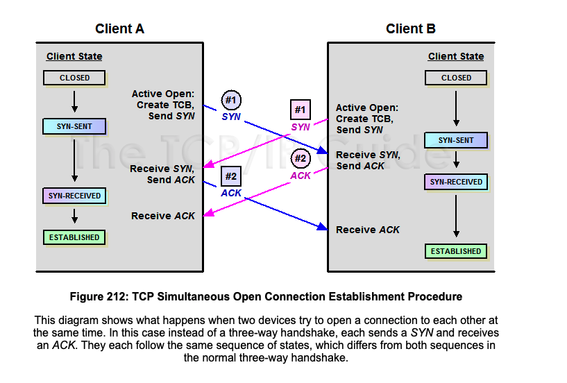
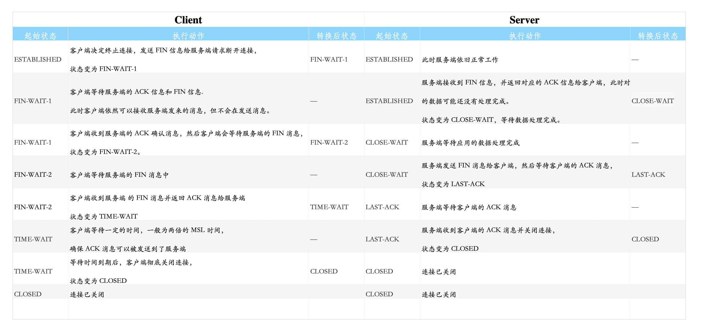
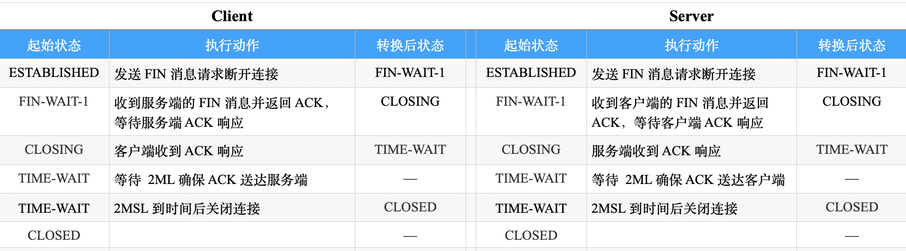
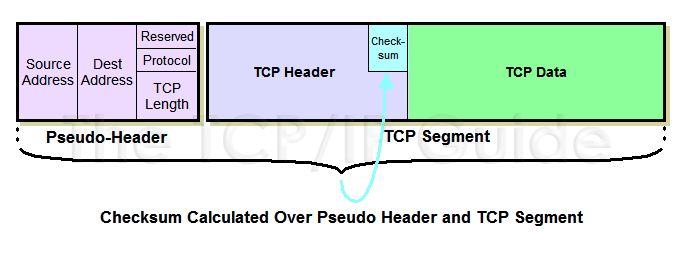

<!-- TOC -->

- [TCP Overview](#tcp-overview)
- [TCP 数据包格式](#tcp-数据包格式)
- [TCP 连接管理](#tcp-连接管理)
  - [1. TCP 有限状态机](#1-tcp-有限状态机)
  - [2. TCP 连接建立过程](#2-tcp-连接建立过程)
  - [3. TCP 连接断开过程](#3-tcp-连接断开过程)
  - [4. 连接建立过程中的参数交换](#4-连接建立过程中的参数交换)
    - [Checksum 校验和计算](#checksum-校验和计算)
    - [Maximum Segment Size (MSS) 确认](#maximum-segment-size-mss-确认)
- [TCP 滑动窗口机制与数据传输](#tcp-滑动窗口机制与数据传输)
  - [1.滑动窗口机制与流控](#1滑动窗口机制与流控)
  - [2.数据重传](#2数据重传)

<!-- /TOC -->

### TCP Overview
### TCP 数据包格式

TCP 的数据包被称为段（Segment），顾名思义，TCP 是面向流的数据传输，其数据是连续的，没有明确的开始与终止边界，每个数据包都是流中的一段数据。

TCP 段包含了众多的字段，之所以有这么多字段是因为 TCP 的连接管理、流控、重传等功能都是依赖于这些字段实现的。下面是TCP segment 结构示意图：

各个字段含义如下表：

  字段名  |大小 (字节 Bytes)|描述
------------------------|--------------|--
 Source Port            | 2 (16 bit)   | 源程序的端口
 Destiation Port        | 2 (16 bit)   | 目的程序的端口
 Sequence Number        | 4 (32 bit)   | 段中数据的序列号，代表段中数据的第一个字节
 Acknowledgement Number | 4 (32 bit)   | 当 ACK 控制位是 1 时，代表这是一个响应包，这是服务端发送给服务端的响应序列号，表示服务端可以接收的下一段数据的序列号是多少。
 Data Offset            | 1/2 (4 bit)  | 数据偏移量，表示数据所在的位置，该值必须是 32 位的倍数。
 Reserved               | 3/4 (6 bits) | 保留位，全部为 0
 Control Bits           | 3/4 (6 bits) | 控制位，表示消息的类型，具体含义在下面的表里解释。
 Window                 | 2 (16 bit)   | 窗口大小，表示当前客户端能接收多少数据
 Checksum               | 2 (16 bit)   | 校验和，用于检查 TCP segment 是否正确
 Urgent Pointer         | 2 (16 bit)   | 紧急指针，配置 URG 控制位使用，表示优先发送某部分数据
 Options                | 可变长度       | 可选项
 Data                   | 可变长度       | 段中数据

**Control Bit 字段值**

对于 Control Bit 字段，其可选值如下：

控制位|大小（字节）|含义
--|--|--
SYN | 1/8 (1 bit) | SYN 为 1，表示是发起连接建立的请求
ACK | 1/8 (1 bit) | ACK 为 1，表示是一条响应信息
FIN | 1/8 (1 bit) | FIN 为 1，表示是终止连接的请求
RST | 1/8 (1 bit) | 表示重置连接
URG | 1/8 (1 bit) | 表示紧急消息，配合 Urgent Pointer 使用优先发送某些数据。
PSH | 1/8 (1 bit) | 表示该 segment 需要被立即发送。

具体字段的取值在后续的连接管理、流控、重传等在看，这里先做一个基本了解即可。

### TCP 连接管理

#### 1. TCP 有限状态机

TCP 的数据传输是建立在可靠的连接之上的，每次发送数据前收发两方需要首先建立连接。TCP 连接本质上就是一个 [有限状态机（finite-state machine，FSM）模型](https://en.wikipedia.org/wiki/Finite-state_machine)，FSM 有四个要素：

- 状态 State
- 事件 Event
- 动作 Action
- 状态转换 Transition

简单来说其 FSM 工作过程一是：

> 首先有一个初始状态(State)，然后出现了某个事件(Event)，触发了某个动作(Action)，引起了某个状态转换(Transition)，最终变成了某个状态(State)。

TCP 连接建立与断开的过程就是就是客户端、服务端各自发生状态转换的过程，下图是 TCP 的状态转换图：

#### 2. TCP 连接建立过程

TCP 连接是一个逻辑上的连接，其实就是一系列的状态数据，比如 socket 地址、序列号、窗口大小等，这些数据由 TCB(transmission control block，传输控制块) 来存储。吗，每个连接都有自己的 TCB 块，在发起连接建立前创建。

这里区分两个概念，TCP 开启连接分为主动打开（Active Open）和被动打开（Passive Open）:

- 主动打开：主动发起连接建立请求，客户端一般都是主动打开 
- 被动打开：被动接收创建立连接的请求

对于服务器端，因为是被动打开，因此开始创建 TCB 时会将 socket 的客户端 IP 和端口设置为 0，并且为了性能一般会提前创建多个 TCB 块，当有客户端请求建立连接时就会将客户端的 IP/端口绑定到某个 TCB 上。

TCP 连接建立三次握手的过程客户端，服务的状态变化与描述如下：

下面是三次握手示意图：

。

下图是 三次握手过程中的数据包

更详细的解释参见另一篇文章[TCP 数据收发过程抓包分析](https://zouyingjie.cn/2019/tcp-data-transform/)

三次握手的过程本质就是客户端与服务端协商与交换各自信息的过程，比如窗口大小、MSS 等信息，客户端和服务端需要各自向对方发送 SYN 信息并等待确认，因此理论上是四次通信，客户端发送 SYN 信息给服务端并等待 ACK 响应以及服务端发送 SYN 给客户端并等待 AC 响应，为了提升性能服务端将 SYN 和 ACK 消息合并在一起发送，因此是三次握手。

关于为什么需要三次握手的更详细解释可以参考[为什么 TCP 建立连接需要三次握手](https://draveness.me/whys-the-design-tcp-three-way-handshake/)

除了正常的三次握手之外，还存在收发两端同时发起建立连接请求的情况，其状态转换与握手过程如下：

)

#### 3. TCP 连接断开过程

在数据传输完成后 TCP 就可以断开连接了，正常情况下的连接断开过程是四步（四次挥手），状态转换与消息发送如下图所示：

当然和连接建立一样，连接断开时也存在客户端和服务端同时发起断开连接的请求，此时状态转换与消息发送如下图所示：

#### 4. 连接建立过程中的参数交换

##### Checksum 校验和计算

##### Maximum Segment Size (MSS) 确认
### TCP 滑动窗口机制与数据传输

#### 1.滑动窗口机制与流控

#### 2.数据重传